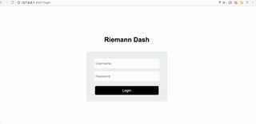

##riemann-dash:

riemann-dash 是一个基于 ruby sinatra 的web展示界面，通过它可以把 riemann 收集到的数据通过不同的形式展示出来。一般来说，真正企业生产
环境的监控系统是不会使用riemann-dash来作数据展示的，因为功能太简单，一些需求满足不了，大多会用 graphite 或者 grafana 来做替换。而我监控的目标
是跑在几台虚拟机上的小爬虫，机器少，需求也简单，所以就没有用其他的工具来替换.
riemann-dash的缺点中我比较不能接受的就是它默认没有用户认证来保护，这不安全。解决这个问题的办法比较常见的是在rack或者前端的nginx上做
http basic auth，但是这样还是不如在应用内部做认证来的痛快，所以我修改了riemann-dash的代码添加了用户登录的功能

##修改代码:

riemann-dash是一个sinatra app, 代码非常简单，要满足我的需求在views目录里需要添加一个login.erubis，css直接写到页面里面了，然后修改controller目录
里面的index.rb文件把登录注销的后端逻辑加入进去。完整代码在 <a class="reference external" href="https://github.com/nuty/riemann-dash.git">这里</a>.

##安装启动:

### 因为没有合并到master也没有推到gems上面，所以只能用源码来安装了

```shell
git clone https://github.com/nuty/riemann-dash.git
cd riemann-dash
```


### clone 完成后使用example下面的配置文件启动:

```shell
./bin/riemann-dash
./example/config.rb

```

### 如果打开配置文件，可以看到添加了两个配置项：

```shell
config.store[:username] = username
config.store[:password] = password
```

启动之后打开浏览器访问： <a class="reference external" href="http://0.0.0.0:4567/">http://0.0.0.0:4567/</a> 
输入在配置文件中设置的用户名和密码即可登录

