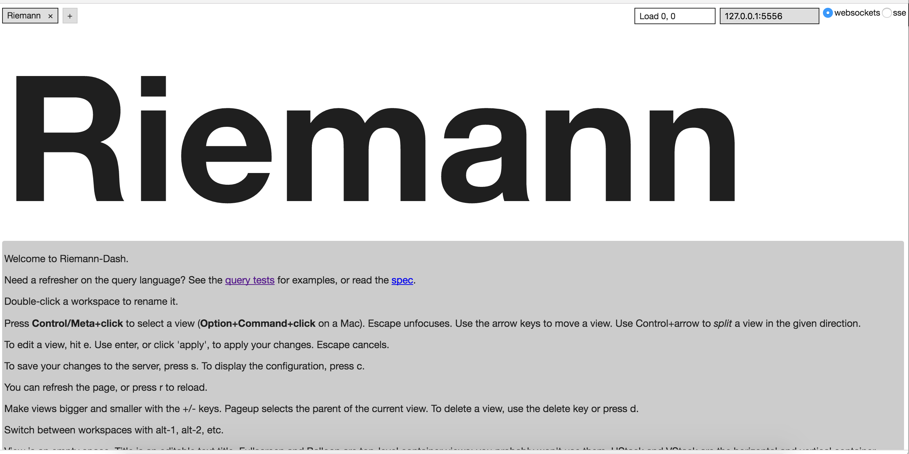
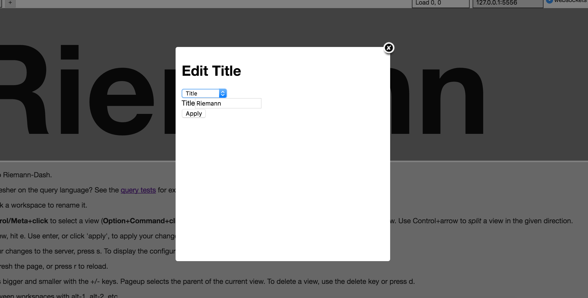
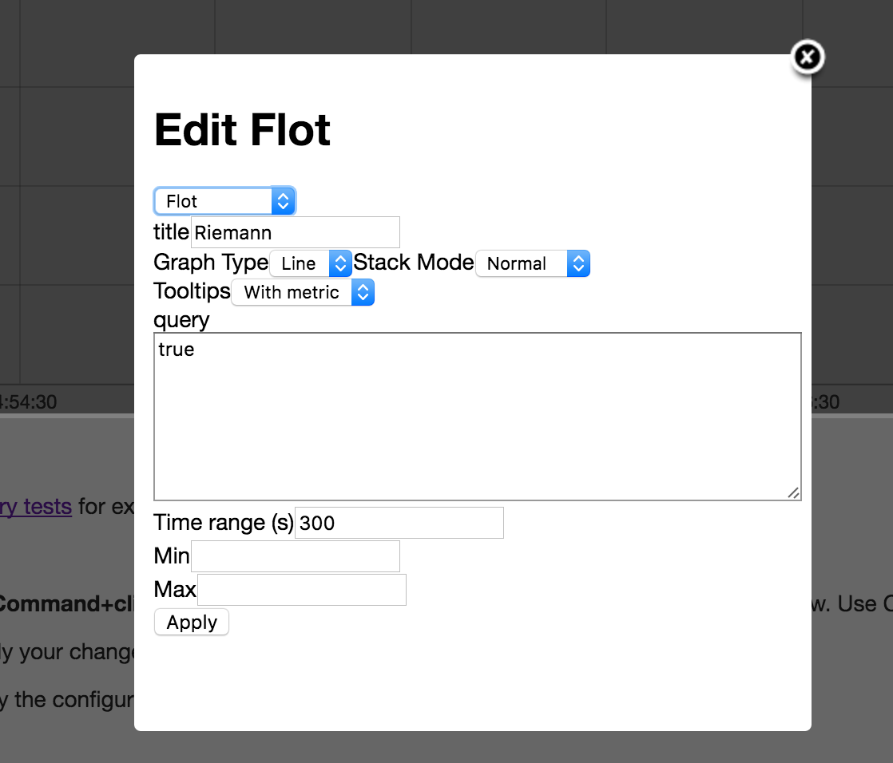
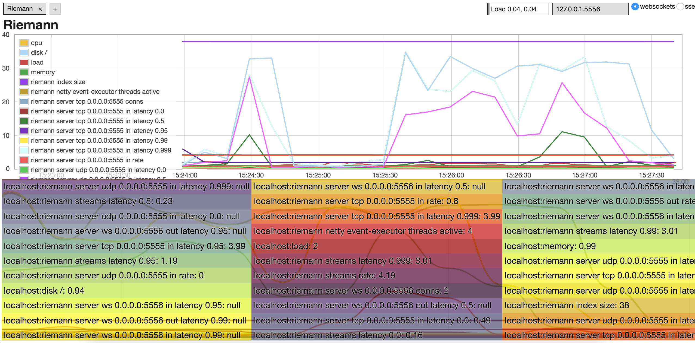

什么是监控系统？
--------

从技术的角度来说，监控系统是一个管理和记录IT系统运行状况的工具，但是监控系统做的远不止这些，它可以把程序出现的问题在用户或客户发现之前， 提前把消息通过邮件或者短信的方式告诉运维人员，可以根据预设的阈值去触发相应的处理流程，也可以把收集到的信息通过用户友好的方式展现出来.

为什么使用riemann？
-------------

*   功能强大，支持多种语言客户端连接，并且提供的大量可插拔使用的插件。
*   轻量级，架构非常灵活，模块之间耦合低，可以任意替换其中某个模块到适合自己的实现方案。
*   系统配置使用clojure，一个跑在jvm上的lisp方言，clojure的表达能力强，事件的过滤和处理简练方便。

系统依赖 :
------

*   java
*   ruby>2.0

安装并启动:
------

riemann 提供了 deb rpm 源码包三种不同的类型供选择，选择适合自己的包下载安装就可以了。我这里使用的是mac，在mac上可以直接使用 brew 来安装：

```shell
brew install riemann
```

riemann 安装完成后下面安装 riemann-dash和riemann-tools， riemann-dash 是一个基于ruby sintra的一个web应用，它提供了一个简单的 dashboard。riemann-tools 是一系列监控插件的集合。这两都是基于ruby，下面使用 gem 来安装：

```shell
gem install riemann-dash riemann-tools -V
```

很简单，安装完成后，下面修改下riemann的配置文件：

```shell
cp /usr/local/etc/riemann.config.guide riemann.config
vi /usr/local/etc/riemann.config

```

然后把配置文件的内容修改成这样：

```shell
; -*- mode: clojure; -*-
; vim: filetype=clojure

(logging/init {:file "/var/log/riemann.log"})

; Listen on the local interface over TCP (5555), UDP (5555), and websockets
; (5556)
(let [host "0.0.0.0"]
  (tcp-server {:host host})
  (udp-server {:host host})
  (ws-server {:host host}))

; Expire old events from the index every 5 seconds.
(periodically-expire 5)

(let [index (index)]
  (streams
    (default :ttl 60
      index
      #(info %))))
```
上面配置修改了host地址，日志文件，和写入日志的类型。 修改完了riemann 的配置下面修改 riemnan-dash 的配置：

vi /usr/local/etc/riemann.dash.rb

写入下面的内容：

```shell
set :port, 4567      # HTTP server on port 4567
set :bind, "0.0.0.0" # Bind to a different interface
config[:ws_config] = 'custom/config.json' # Specify custom workspace config

```

### 启动riemann：
```shell
riemann /usr/local/etc/riemann.config

```

### 启动riemann-dash：

riemann-dash /usr/local/etc/riemann.dash.rb

启动之后打开浏览器访问： [http://127.0.0.1:4567/](http://127.0.0.1:4567/) 可以看到下面的界面




现在界面出来了，但是是空的，现在需要把监控数据传给riemann，然后在dashboard上展示出来，在配置展示页面之前开启一个汇报程序 riemann-health，这个程序会把系统的信息汇报给riemann，然后就可以配置dashboard，展示这些数据了。

```shell
riemann-health

```

### 可以在riemann的log里面看到日志：

```shell
INFO \[2016-09-10 22:46:32,539\] Thread-4 - riemann.config - #riemann.codec.Event{:host localhost, :service riemann server tcp 0.0.0.0:5555 in latency 0.5, :state ok, :description nil, :metric 635377/500000, :tags nil, :time 294703758507/200, :ttl 20}
INFO \[2016-09-10 22:46:32,540\] Thread-4 - riemann.config - #riemann.codec.Event{:host localhost, :service riemann server tcp 0.0.0.0:5555 in latency 0.95, :state ok, :description nil, :metric 1343/800, :tags nil, :time 294703758507/200, :ttl 20}
INFO \[2016-09-10 22:46:32,540\] Thread-4 - riemann.config - #riemann.codec.Event{:host localhost, :service riemann server tcp 0.0.0.0:5555 in latency 0.99, :state ok, :description nil, :metric 1343/800, :tags nil, :time 294703758507/200, :ttl 20}
INFO \[2016-09-10 22:46:32,540\] Thread-4 - riemann.config - #riemann.codec.Event{:host localhost, :service riemann server tcp 0.0.0.0:5555 in latency 0.999, :state ok, :description nil, :metric 1343/800, :tags nil, :time 294703758507/200, :ttl 20}
INFO \[2016-09-10 22:46:32,541\] Thread-4 - riemann.config - #riemann.codec.Event{:host localhost, :service riemann server udp 0.0.0.0:5555 in rate, :state ok, :description nil, :metric 0.0, :tags nil, :time 294703758507/200, :ttl 20}

```


这些就是riemann-health 发给riemann的数据。下面该配置dashboard了，现在回到web界面，然后根据提示，选择当前操作系统对应的快捷键 比如在mac上就是 按下 option + command 同时点击页面，看到阴影后，按 e 键，可以看到一个弹出框：



然后选择下拉列表中的一个，比如 flot，在 query 中写 true。然后点击apply




下面的help text 也可以照上面的方法如法炮制, 这次可以不选flot，可以选择其他的选项比如log，编辑完成后按 s 键保存配置，下次打开的时候，还是配置过的界面。


